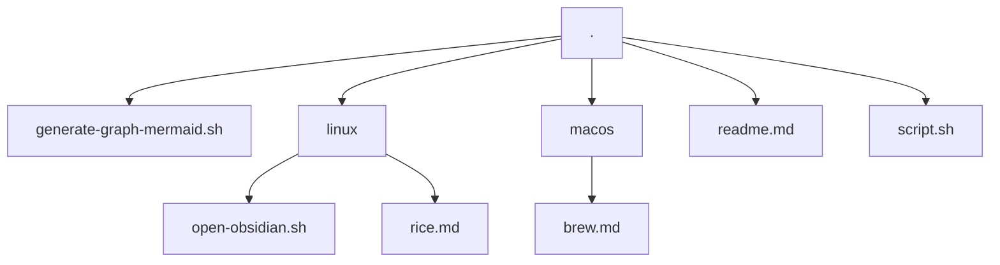

```mermaid
graph TD;
    Root[.]
    Root --> generate-graph-mermaid.sh
    Root --> linux
    linux --> open-obsidian.sh
    linux --> rice.md
    Root --> macos
    macos --> brew.md
    Root --> readme.md
    Root --> script.sh
```
