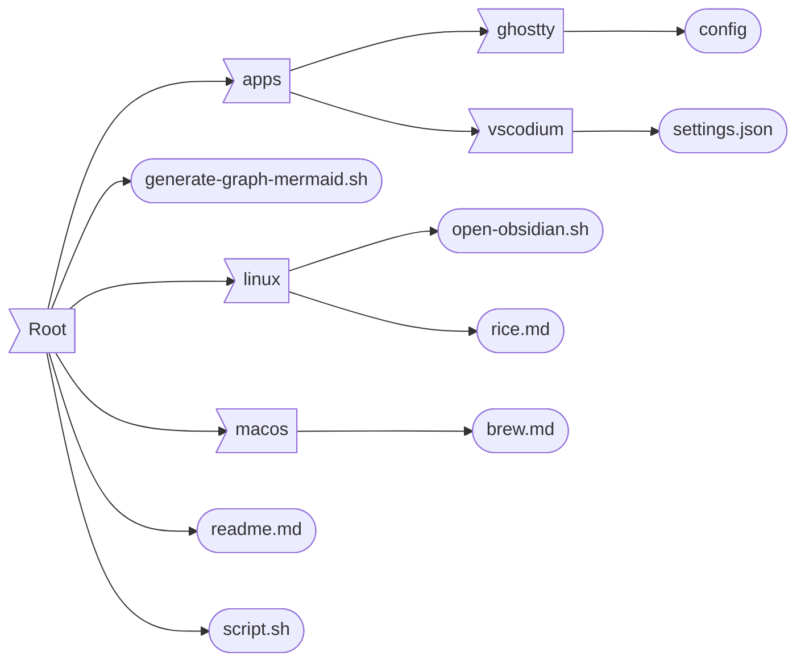

```mermaid
graph LR;
    Root[.]
    Root>Root] --> apps>apps]
    apps>apps] --> ghostty>ghostty]
    ghostty>ghostty] --> config([config])
    apps>apps] --> vscodium>vscodium]
    vscodium>vscodium] --> settings.json([settings.json])
    Root>Root] --> generate-graph-mermaid.sh([generate-graph-mermaid.sh])
    Root>Root] --> linux>linux]
    linux>linux] --> open-obsidian.sh([open-obsidian.sh])
    linux>linux] --> rice.md([rice.md])
    Root>Root] --> macos>macos]
    macos>macos] --> brew.md([brew.md])
    Root>Root] --> readme.md([readme.md])
    Root>Root] --> script.sh([script.sh])
```
