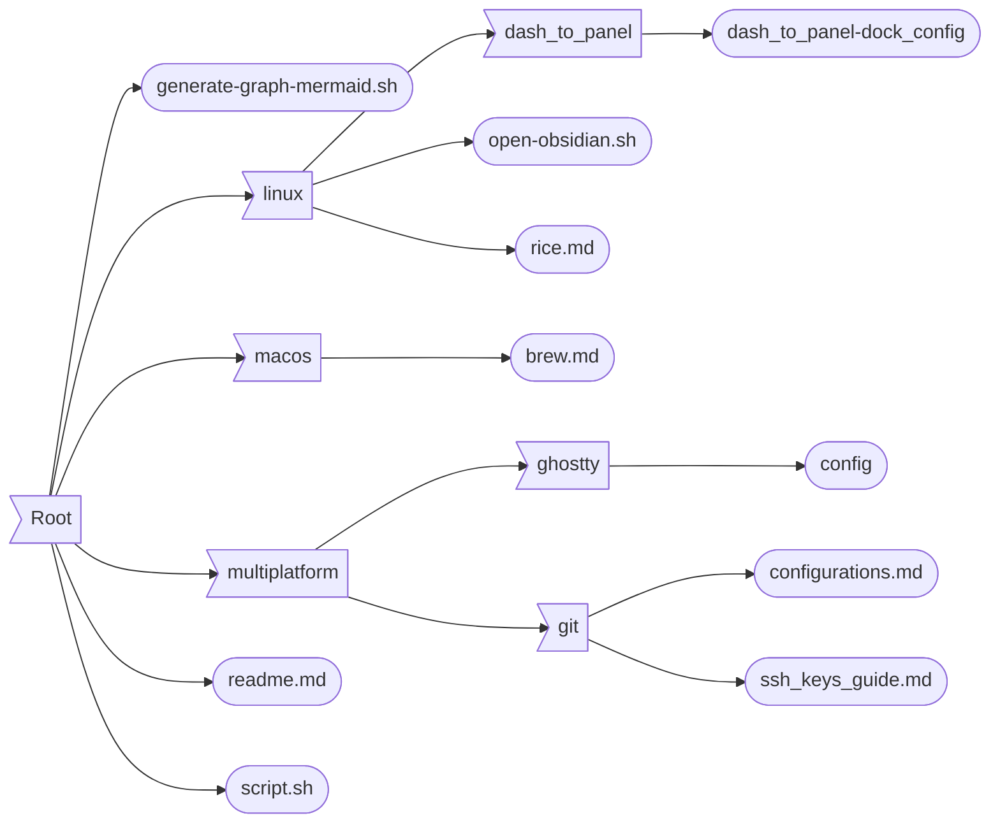

```mermaid
graph LR;
    Root[.]
    Root>Root] --> generate-graph-mermaid.sh([generate-graph-mermaid.sh])
    Root>Root] --> linux>linux]
    linux>linux] --> dash_to_panel>dash_to_panel]
    dash_to_panel>dash_to_panel] --> dash_to_panel-dock_config([dash_to_panel-dock_config])
    linux>linux] --> open-obsidian.sh([open-obsidian.sh])
    linux>linux] --> rice.md([rice.md])
    Root>Root] --> macos>macos]
    macos>macos] --> brew.md([brew.md])
    Root>Root] --> multiplatform>multiplatform]
    multiplatform>multiplatform] --> ghostty>ghostty]
    ghostty>ghostty] --> config([config])
    multiplatform>multiplatform] --> git>git]
    git>git] --> configurations.md([configurations.md])
    git>git] --> ssh_keys_guide.md([ssh_keys_guide.md])
    Root>Root] --> readme.md([readme.md])
    Root>Root] --> script.sh([script.sh])
```
